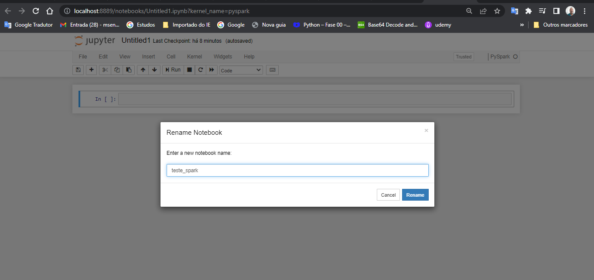
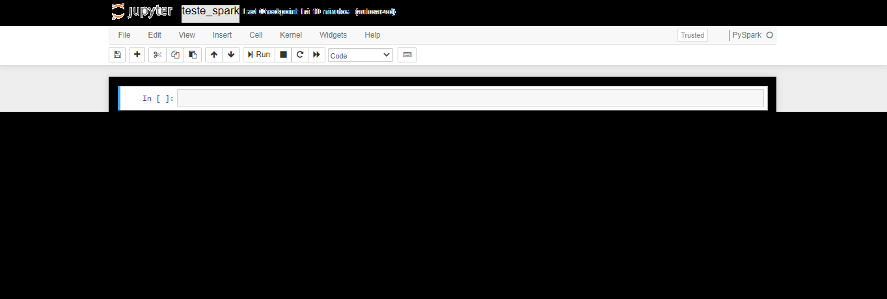
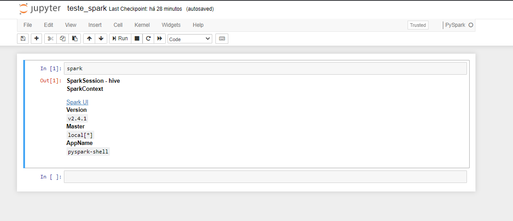
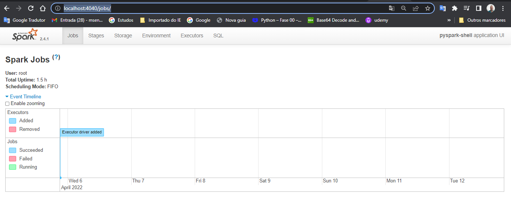
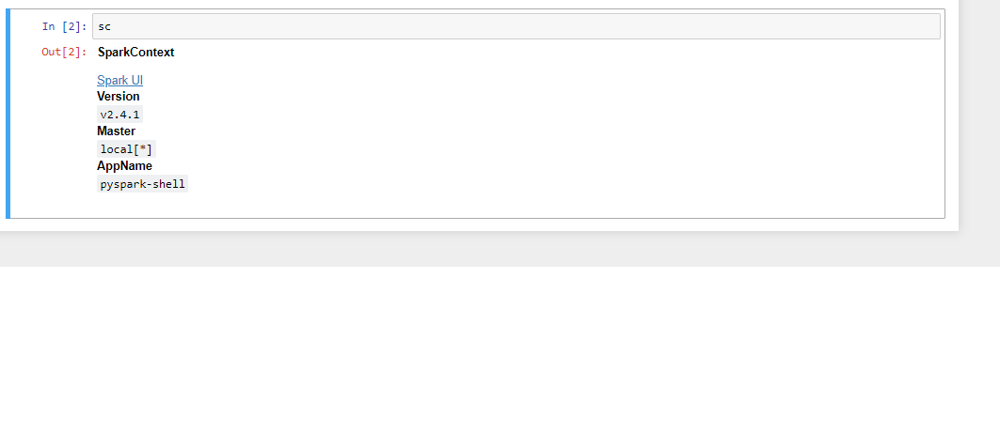
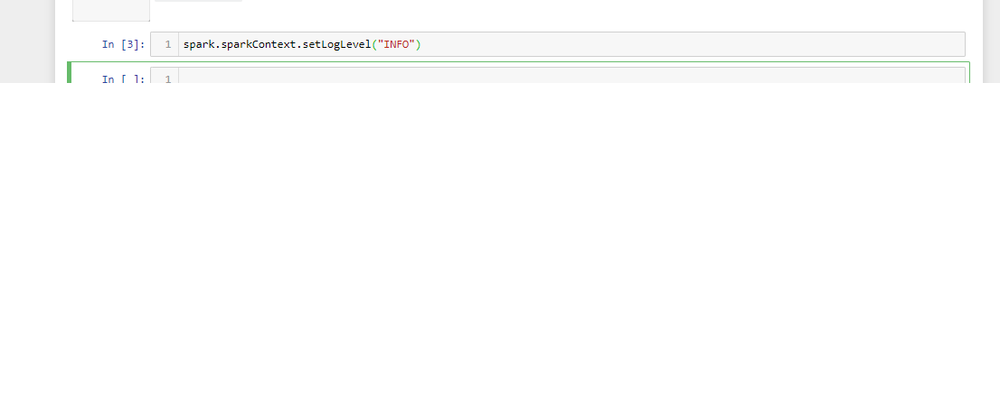
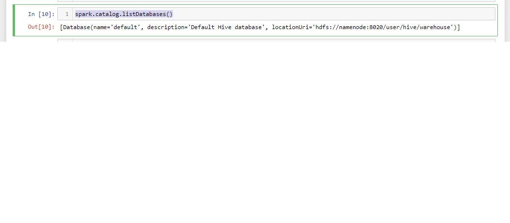

#  Exerc-Aula02 – Testar o Jupyter Notebook

## 1. Criar o arquivo do notebook com o nome teste_spark.ipynb

No browse: localhost:8889-->new-->selecionar pyspark
-->Alterar o nome 

## 2. Obter as informações da sessão de spark (spark)

Digite spark na célula e Shift + <enter> que executará o comando e abrirá outra célula.

É possível verificar na interface gráfica digitando
no browse: http://localhost:4040/jobs/

## 3. Obter as informações do contexto do spark (sc)
Aqui vamos usar o "sc" e teclar ctrl + <enter>, 
podemos observar que seráexecutado ocomando,porém não será aberto outra célula.
<code>sc</code>

## 4. Setar o log como INFO.
<code>spark.sparkContext.setLogLevel("INFO")</code>

## 5. Visualizar todos os banco de dados com o catalog
 <code>spark.catalog.listDatabases() </code>

 <prev>[Database(name='default', description='Default Hive database', locationUri='hdfs://namenode:8020/user/hive/warehouse')] </prev>

## 6. Ler os dados "hdfs://namenode:8020/user/rodrigo/data/juros_selic/juros_selic.json“ com uso de Dataframe
<code>
leitura_juros = spark.read.json("hdfs://namenode:8020/user/marco/data/juros_selic/juros_selic.json")
</code>

## 7. Salvar o Dataframe como juros no formato de tabela Hive

<code>leitura_juros.write.saveAsTable("juros") </code>

## 8. Visualizar todas as tabelas com o catalog
<code>spark.catalog.listTables() </code>

## 9. Visualizar no hdfs o formato e compressão que está a tabela juros do Hive
<code>!hdfs dfs -ls /user/hive/warehouse/juros </code>
<prev>
Found 2 items
-rw-r--r--   2 root supergroup          0 2022-04-06 01:48 /user/hive/warehouse/juros/_SUCCESS
-rw-r--r--   2 root supergroup       3883 2022-04-06 01:48 /user/hive/warehouse/juros/part-00000-3f664dff-a1c5-4194-88f0-9a59c00bfbae-c000.snappy.parquet>
</prev>

## 10. Ler e visualizar os dados da tabela juros, com uso de Dataframe no formato de Tabela Hive
<code>spark.read.table("juros").show(5) </code>

<prev>
+----------+-----+
|      data|valor|
+----------+-----+
|01/06/1986| 1.27|
|01/07/1986| 1.95|
|01/08/1986| 2.57|
|01/09/1986| 2.94|
|01/10/1986| 1.96|
+----------+-----+
only showing top 5 rows
</prev>

## 11. Ler e visualizar os dados da tabela juros , com uso de Dataframe no formato Parquet
<code>spark.read.parquet("/user/hive/warehouse/juros").show(5) </code>
<prev>
+----------+-----+
|      data|valor|
+----------+-----+
|01/06/1986| 1.27|
|01/07/1986| 1.95|
|01/08/1986| 2.57|
|01/09/1986| 2.94|
|01/10/1986| 1.96|
+----------+-----+
only showing top 5 rows
</prev>

## 12. Clicar no botão de Enviar Tarefa, e enviar o texto: ok